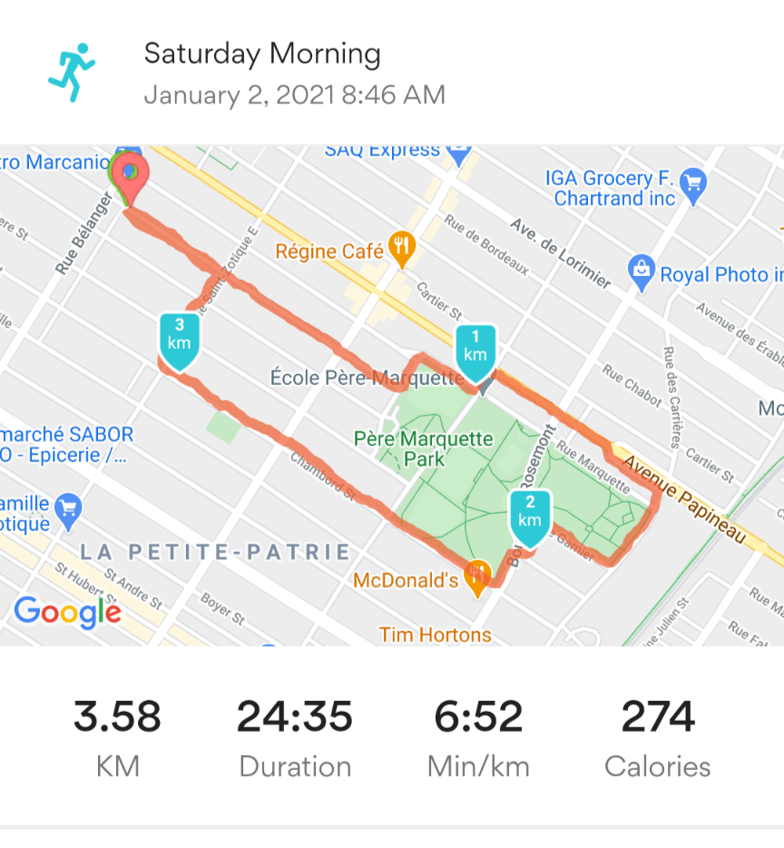
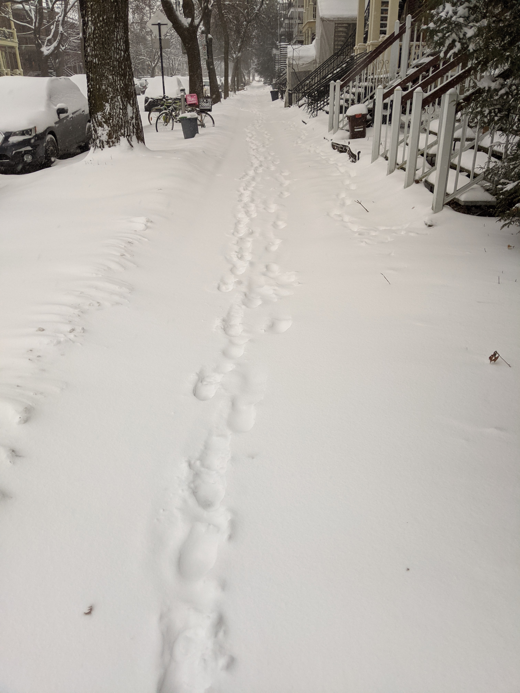

```{r setup, include=FALSE}
knitr::opts_chunk$set(echo = TRUE)
library(readxl)
library(dplyr)
```

## My run

Here's what I ran on Jan 2, 2021:
```{r read,include=FALSE}
AEA5k <- read_excel("AEA5k.xlsx")
actual.run = 3.6
```

```{r print}
AEA5k
```
though the final distance was `r actual.run` km. 



Mitigating circumstances were  

- not having run in 7 months
- 10cm of snow (see data-driven proof below)
- a little old lady needing help getting up a frozen incline.




## Submission

```{r predict,include=FALSE}

ols <- lm(pace ~ km,AEA5k)
lars <- predict(ols,newdata = AEA5k,se.fit = TRUE)
tmp <- as_tibble(lars$fit,rownames="row") %>% 
  mutate(km=as.numeric(row),pace.predict=value) %>% 
  select(km,pace.predict) %>% 
  left_join(AEA5k,by="km") 
theory <- as_tibble(lars$se.fit,rownames="row") %>% 
  mutate(km=as.numeric(row),se=value) %>% 
  select(km,se) %>% 
  left_join(tmp,by="km") %>%
  mutate(use = if_else(is.na(pace),pace.predict,pace),
         se.use=if_else(is.na(pace),se,0)) %>% 
  mutate(upper=1.96*se.use + use,lower=-1.96*se.use + use)

```

Based on my actual run of `r actual.run` km, my humble data-driven submission to the AEA 5k challenge is based on:

```{r show}
ols
```

```{r results}
theory %>% summarize(eta=sum(use),eta.lower=sum(lower),eta.upper=sum(upper)) -> submission
print(submission)
```
and I thus humbly submit a time of **`r submission$eta`** minutes for 5 km (all units decimal; though honestly that upper bound of `r submission$eta.upper` looks really reasonable).

## Data and Code Availability Statement

All data are made available in this repository. All code is in the R Markdown document. 

## Replication Info

Re-running the code might take a few seconds on a reasonably modern system.
Re-running the data collection might take a reasonably modern person anywhere from 20 to 60 minutes. Data collection protocol may require shoes, appropriate clothing, and is unlikely to succeed in the presence of substantial flooding.

```{r sysinfo}
Sys.info()
sessionInfo()
```
