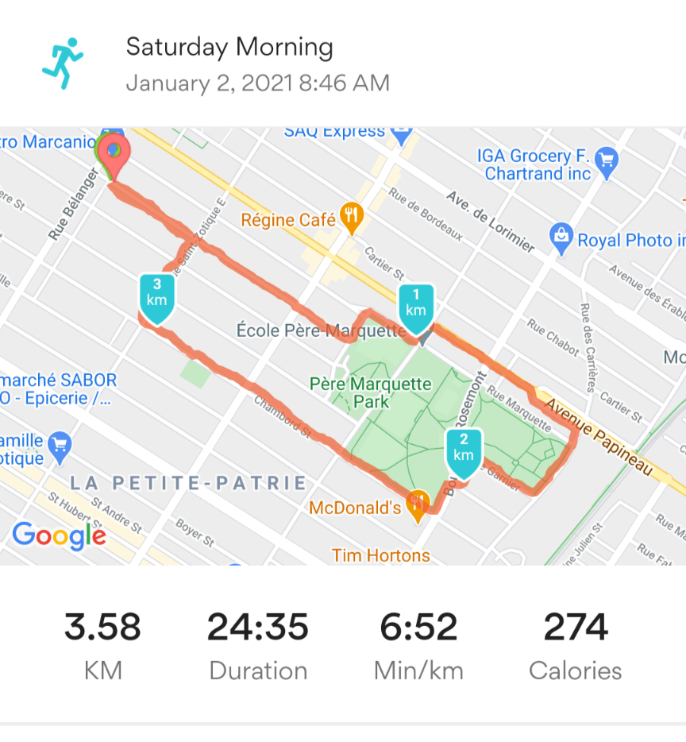

## My run

Here's what I ran on Jan 2, 2021:


```r
AEA5k
```

```
## # A tibble: 5 x 2
##      km  pace
##   <dbl> <dbl>
## 1     1  6.4 
## 2     2  7.15
## 3     3  6.67
## 4     4 NA   
## 5     5 NA
```
though the final distance was 3.6 km. 



Mitigating circumstances were  

- not having run in 7 months
- 10cm of snow (see data-driven proof below)
- a little old lady needing help getting up a frozen incline.


## Submission


Based on my actual run of 3.6 km, my humble data-driven submission to the AEA 5k challenge is based on:


```r
ols
```

```
## 
## Call:
## lm(formula = pace ~ km, data = AEA5k)
## 
## Coefficients:
## (Intercept)           km  
##      6.4722       0.1333
```


```r
theory %>% summarize(eta=sum(use),eta.lower=sum(lower),eta.upper=sum(upper)) -> submission
print(submission)
```

```
## # A tibble: 1 x 3
##     eta eta.lower eta.upper
##   <dbl>     <dbl>     <dbl>
## 1  34.4      30.7      38.0
```
and I thus humbly submit a time of **34.3611111** minutes for 5 km (all units decimal; though honestly that upper bound of 38.0382064 looks really reasonable).

## Data and Code Availability Statement

All data are made available in this repository. All code is in the R Markdown document. 

## Replication Info

Re-running the code might take a few seconds on a reasonably modern system.
Re-running the data collection might take a reasonably modern person anywhere from 20 to 60 minutes. Data collection protocol may require shoes, appropriate clothing, and is unlikely to succeed in the presence of substantial flooding.


```r
Sys.info()
```

```
##        sysname        release        version       nodename        machine 
##      "Windows"       "10 x64"  "build 19042" "LARS-X1-2018"       "x86-64" 
##          login           user effective_user 
##         "lars"         "lars"         "lars"
```

```r
sessionInfo()
```

```
## R version 4.0.2 (2020-06-22)
## Platform: x86_64-w64-mingw32/x64 (64-bit)
## Running under: Windows 10 x64 (build 19042)
## 
## Matrix products: default
## 
## locale:
## [1] LC_COLLATE=English_United States.1252 
## [2] LC_CTYPE=English_United States.1252   
## [3] LC_MONETARY=English_United States.1252
## [4] LC_NUMERIC=C                          
## [5] LC_TIME=English_United States.1252    
## 
## attached base packages:
## [1] stats     graphics  grDevices utils     datasets  methods   base     
## 
## other attached packages:
## [1] dplyr_1.0.2  readxl_1.3.1
## 
## loaded via a namespace (and not attached):
##  [1] Rcpp_1.0.5       knitr_1.30       magrittr_2.0.1   tidyselect_1.1.0
##  [5] R6_2.5.0         rlang_0.4.9      fansi_0.4.1      stringr_1.4.0   
##  [9] tools_4.0.2      xfun_0.19        utf8_1.1.4       cli_2.2.0       
## [13] htmltools_0.5.0  ellipsis_0.3.1   assertthat_0.2.1 yaml_2.2.1      
## [17] digest_0.6.27    tibble_3.0.4     lifecycle_0.2.0  crayon_1.3.4    
## [21] purrr_0.3.4      vctrs_0.3.5      glue_1.4.2       evaluate_0.14   
## [25] rmarkdown_2.5    stringi_1.5.3    compiler_4.0.2   pillar_1.4.7    
## [29] cellranger_1.1.0 generics_0.1.0   pkgconfig_2.0.3
```
