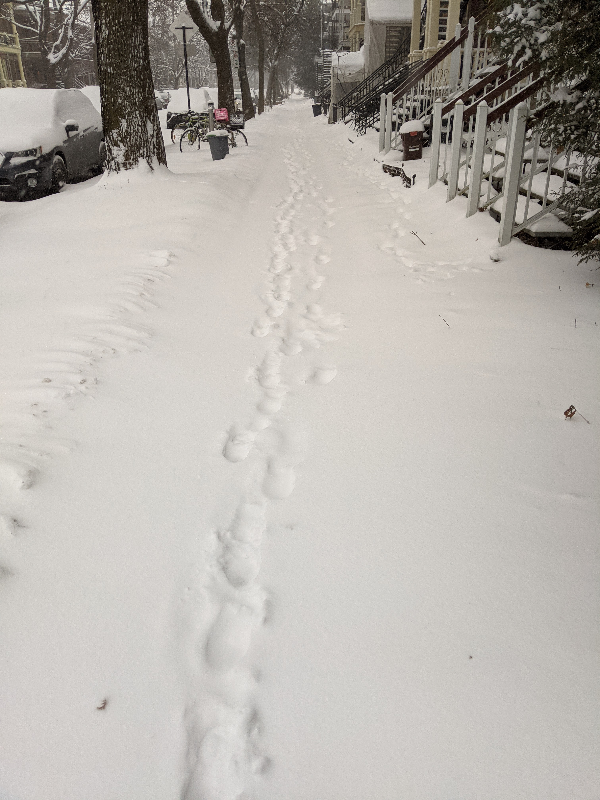

## My run

Here's what I ran on Jan 1, 2021:


```r
AEA5k
```

```
## # A tibble: 5 x 2
##      km  pace
##   <dbl> <dbl>
## 1     1  6.4 
## 2     2  7.15
## 3     3  6.67
## 4     4 NA   
## 5     5 NA
```
though the final distance was 3.6 km. 


Mitigating circumstances were  

- not having run in 7 months
- 10cm of snow (see data-driven proof below)
- a little old lady needing help getting up a frozen incline.




## Submission


Based on my actual run of 3.6 km, my humble data-driven submission to the AEA 5k challenge is based on:


```r
ols
```

```
## 
## Call:
## lm(formula = pace ~ km, data = AEA5k)
## 
## Coefficients:
## (Intercept)           km  
##      6.4722       0.1333
```


```r
theory %>% summarize(eta=sum(use),eta.lower=sum(lower),eta.upper=sum(upper)) -> submission
print(submission)
```

```
## # A tibble: 1 x 3
##     eta eta.lower eta.upper
##   <dbl>     <dbl>     <dbl>
## 1  34.4      30.7      38.0
```
and I thus humbly submit a time of **34.3611111** minutes for 5 km (all units decimal; though honestly that upper bound of 38.0382064 looks really reasonable).

